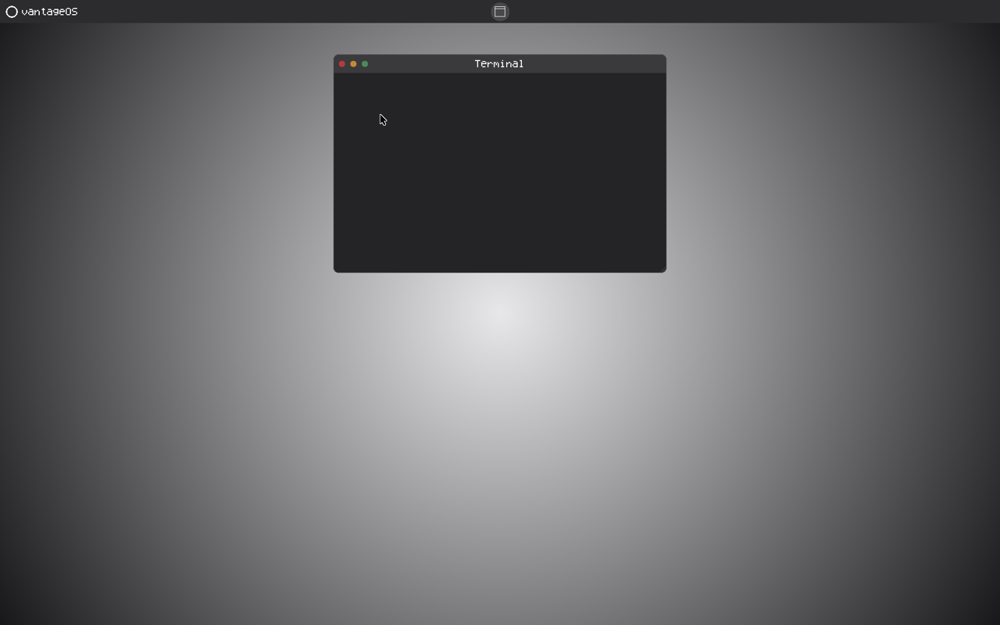

# vantageOS


A personal operating system built from scratch in Rust, targeting ARM64. It takes inspiration from the privacy and openness of Linux, the polish and restraint of macOS, and the hardware flexibility of Windows. See [DESIGN.md](./DESIGN.md) for the full product/UX philosophy behind it (touch targets, color system, motion, accessibility).

Boots straight into a graphical desktop shell under QEMU: no filesystem, no processes, no allocator. A single-core, single-address-space kernel with a compositor, a mouse-driven UI, and a real shutdown path.



## Status

Working today:
- Graphical desktop (gradient wallpaper, top bar, system menu with a Volume slider and a working **Shut Down** button)
- Mouse cursor and click/drag handling, driven by a polled virtio input device
- A draggable, resizable app window (title bar, traffic lights, rounded corners) opened from a Terminal icon in the top bar — chrome only for now, no keyboard input wired up yet
- A boot log rendered both over serial and on screen

Not yet: real applications, keyboard input, a filesystem, multitasking, or a real-hardware target (QEMU's `virt` machine only, for now).

## Quick start

Requires QEMU and the Rust bare-metal ARM64 target:

```bash
brew install qemu
rustup target add aarch64-unknown-none
rustup component add llvm-tools-preview
```

Then:

```bash
make run            # debug build, boots in a QEMU graphics window
make run-release     # optimized build
make run-headless    # serial-only, no graphics window
```

`Ctrl-A` `C` switches the terminal to the QEMU monitor (`quit` to exit); closing the graphics window works too.

## Project layout

```
src/boot.s           # assembly entry point: core parking, FP/SIMD enable, .bss zeroing
src/main.rs          # no_std entry point: boot log, panic handler, idle loop
src/uart.rs          # PL011 UART driver + print!/println! macros
src/fw_cfg.rs        # QEMU fw_cfg guest/host config channel
src/framebuffer.rs   # ramfb virtual display, pixel buffer, put_pixel/fill_rect
src/font.rs          # tiny hand-drawn 5x7 bitmap font
src/console.rs       # boot-log text renderer
src/gui.rs           # the compositor: wallpaper, top bar, panel, window, cursor
src/desktop.rs       # click/drag decision logic
src/power.rs         # PSCI shutdown (real ARM firmware call, not QEMU-specific)
src/virtio_input.rs  # legacy virtio-mmio mouse driver
src/shell.rs, src/commands.rs  # serial line-input shell, not wired into boot yet
```

## Contributing

Contributions are welcome:

1. Fork the repository.
2. Create a new branch (`git checkout -b feature/your-feature`).
3. Commit your changes.
4. Open a Pull Request.

For major changes, please open an issue first to discuss what you'd like to change.

## License

MIT License, see [LICENSE](./LICENSE) for details.
